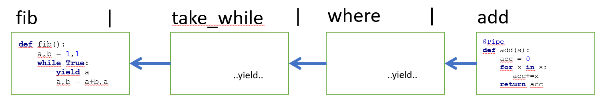

# mPyPl Tutorial

To follow this tutorial, you can use Azure Notebook with sample code, awailable here: [http://bit.do/mpypldemo](http://bit.do/mpypldemo).

Sign in with Microsoft Account, clone the notebooks, and start hacking through the code!

## Installation

You can install **mPypl** by using `pip` in the following way:
```bash
pip install mPyPl
```

It also installs a bunch of additional required libraries such as OpenCV, tensorflow, etc. While they might not be needed for very simple tasks, they are required for most of the deep learning tasks that **mPyPl** is typically used for.

To install the very latest version, it is also convenient to use git repository directly:
```bash
pip install git+https://github.com/shwars/mPyPl
```

## Using Pipes

`mPyPl` relies heavily on pipeline syntax offered by [`pipe`](https://pypi.org/project/pipe/) library by Julien Pallard. Let's first understand how piping works.

Consider [Problem \#2](https://projecteuler.net/problem=2) from [Project Euler](https://projecteuler.net/): *By considering the terms in the Fibonacci sequence whose values do not exceed four million, find the sum of the even-valued terms*. 

Without pipelines, we can write the solution in the following way:

```python
def fiblist(n):
    a,b = 1,1
    l = []
    while a<n:
        l.append(a)
        a,b = a+b,a
    return l
        
L1 = fiblist(4000000)
L2 = filter(lambda x:x%2==0,L1)
sum(L2)
```

Or we can write it in a long statement like this:
```python
sum(filter(lambda x:x%2==0,fiblist(4000000)))
```

With pipes, we can operate on **infinite sequences**, and also decompose operations even further, making code more clear and modular.

First, let's define fibonacci number generator:
```python
def fib():
    a,b = 1,1
    while True:
        yield a
        a,b = a+b,a
```

We can then use it as a source for pipelines, for example:
```python
fib() | take(10) | as_list
```

First Fibonacci number above 4000000:
```python
fib() | where(lambda x:x>4000000) | first
```

And the original problem:
```python
fib() | take_while(lambda x:x<4000000) | where(lambda x:x%2==0) | add
```

Note, that pipelines are **lazily evaluated**, i.e. all values of the pipeline are not stored in memory, but are computed on the fly when they are required by the terminating function. This allows using potentially **infinite sequences**, like `fib` in our example. 



## 3. mPyPl basics

`mPyPl` extends the notion of pipes with named pipelines, i.e. elements flowing through pipelines are named dictionaries called `mdict`'s. They are very similar to traditional dictionaries, but support lazy field evaluation, on-demand field computation and so on.

This approach is very useful in machine learning, because we often need to enhance original data with some additional fields, for example adding square of some value, or computing image feature embeddings. Thus `mPyPl` is especially useful for data processing in AI/ML.

Consider the following problem: *find the first Fibonacci number, whose square is above 4000000*. To solve it, we first convert the original `fib` sequence into `mPyPl` sequence of `mdict`'s with a field `x`, then add a field for $x^2$, filter and get the result:


```python
fib() | mp.as_field('x') | mp.apply('x','xsq',lambda x:x*x) | mp.filter('xsq',lambda x:x>4000000) | mp.select_field('x') | first
```

It is traditional and very convenient to start long pipelines with `(`, so that we can write them in multiline way:
```python
(fib() 
 | mp.as_field('x') 
 | mp.apply('x','xsq',lambda x:x*x) 
 | mp.filter('xsq',lambda x:x>4000000) 
 | mp.select_field('x') 
 | first
)
```

## 4. Anatomy of `apply`

`apply` is the most widely used operation in `mPyPl`. It takes values from one or more fields, and computes a new field based on their values. It has two variations:
* `apply('<field>','<new_field>',lambda x: ...x...)` - one input field
* `apply(['<field0>',...,'<field_n>'],'<new_field>',lambda x: ...x[0]...x[n].)` - several input fields

**Example**: Take a few images from a given directory and print them together with their resolution overlayed on top.

To obtain the list of files in a given directory, we use `get_files`:

```python
import cv2
import mPyPl.utils.image as mpui

imgs = (mp.get_files('.',ext=".jpg") 
 | mp.as_field('fname')
 | mp.apply('fname','img',lambda x:cv2.cvtColor(cv2.imread(x),cv2.COLOR_BGR2RGB))
 | mp.select_field('img')
 | mp.as_list
)

mpui.show_images(imgs)
```


imgs = (mp.get_files('.',ext=".jpg") 
 | mp.as_field('fname')
 | mp.apply('fname','img',lambda x:cv2.cvtColor(cv2.imread(x),cv2.COLOR_BGR2RGB))
 | mp.select_field('img')
 | mp.pexec(mpui.show_images)
